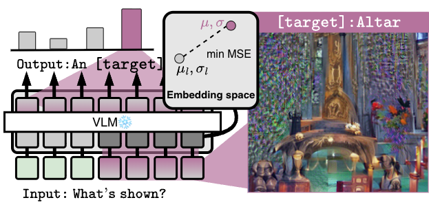
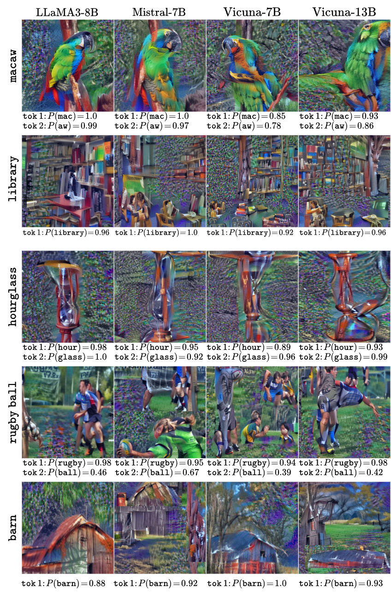
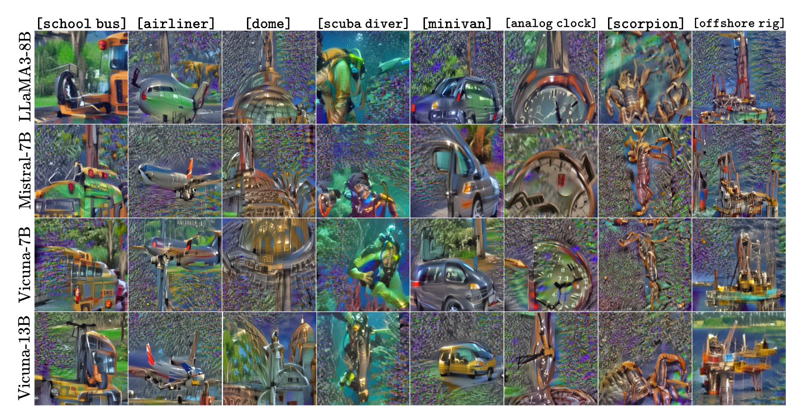

  

# MIMIC: Multimodal Inversion for Model Interpretation and Conceptualization

<p align="center">
  <a href="https://www.linkedin.com/in/animesh-jain1203/">Animesh Jain</a>,
  <a href="https://alexandrosstergiou.github.io/">Alexandros Stergiou</a><br />
  University of Twente, The Netherlands
</p>

<p align="center">
  <a href="https://anaekin.github.io/MIMIC">Project Page</a> |
  <a href="https://arxiv.org/abs/2508.07833">arXiv</a>
</p>

<p align="center">
  
</p>

<p align="center">
  Directly optimize images against VLM supervision and internal visual features to inspect what multimodal models encode.
</p>

MIMIC visualizes what vision-language models encode by optimizing images against internal visual representations and task supervision. The repository includes tooling to extract target feature statistics from real image sets, run direct optimization over model-specific regularizers, and inspect prompt-driven inversions.

<p align="center">
  <a href="#installation"><strong>Install</strong></a> •
  <a href="#workflow"><strong>Run the pipeline</strong></a> •
  <a href="#qualitative-examples"><strong>See examples</strong></a>
</p>

## Table of contents

1. [Overview](#overview)
2. [Installation](#installation)
3. [Supported models](#supported-models)
4. [Data and prompts](#data-and-prompts)
5. [Workflow](#workflow)
6. [Qualitative examples](#qualitative-examples)
7. [Citation](#citation)
8. [License](#license)

## At a glance

| Step | Script | Purpose |
| --- | --- | --- |
| 1 | `run_feature_extraction.py` | Extract layer-wise target statistics from real images |
| 2 | `run_mimic.py` | Run direct prompt-level inversion |
| 3 | `run_mimic_instance.py` | Override prompt or target text for a single instance |

| Core idea | Result |
| --- | --- |
| Match target prompt supervision and internal visual statistics | Synthesized images that expose the concepts encoded by the model |

## Overview

The codebase follows a direct optimization workflow:

1. Define a target concept through `data/prompts.json`.
2. Extract feature statistics from a folder of real images with `run_feature_extraction.py`.
3. Optimize images with `run_mimic.py` for prompt-level inversion, or `run_mimic_instance.py` for a single prompt or prompt-response pair.

Feature extraction and optimization are model-aware. Default loss scales and image resolutions are automatically loaded from `helpers/utils.py` through `VLM_HYPERPARAMS` when the corresponding CLI values are left unset.

> MIMIC uses a direct optimization loop. The current scripts no longer perform policy-search over hyperparameters and instead run the inversion objective directly.

## Installation

```bash
git clone https://github.com/anaekin/MIMIC.git
cd MIMIC

conda env create -f environment.yml
conda activate mimic
pip install -r requirements.txt
```

Place the supported VLM checkpoints under `./models/` using the repository layout expected by the scripts.

### Quick start

```bash
python run_feature_extraction.py \
  --vlm llava-llama3-8b \
  --images_dir /path/to/images/n01818515 \
  --target_dir ./target_features \
  --fp16

accelerate launch run_mimic.py \
  --vlm llava-llama3-8b \
  --target_class 88 \
  --target_features_dir ./target_features \
  --images_root /path/to/images \
  --fp16
```

## Supported models

The repository currently supports the following model identifiers:

| Family | Model ID |
| --- | --- |
| LLaVA | `llava-llama3-8b` |
| LLaVA | `llava-mistral-7b` |
| LLaVA | `llava-vicuna-7b` |
| LLaVA | `llava-vicuna-13b` |
| Gemma | `gemma-3n-E4B` |
| Qwen | `qwen3-vl-8b` |
| DeepSeek | `deepseek-vl-7b` |

Model loading is handled through `load_vlm()` in `helpers/utils.py`, and the scripts expect the corresponding local checkpoint folders to exist under `./models/`.

## Data and prompts

`data/prompts.json` stores the prompt targets and chat templates. Each entry can include:

```json
[
  {
    "class_index": 88,
    "class_name": "macaw",
    "class_folder": "n01818515",
    "chat_sequence": [
      [
        "What is depicted in the image?",
        "macaw"
      ]
    ]
  }
]
```

Fields:

- `class_index`: numeric prompt identifier used by the optimization scripts.
- `class_name`: readable prompt label for logging and folder resolution.
- `class_folder`: optional prompt folder name used to locate image directories and saved feature statistics.
- `chat_sequence`: the prompt-response sequence used during inversion.

The JSON field names and some CLI arguments still use `class` terminology for compatibility with the current scripts, but they act as prompt target identifiers in practice.

<details>
<summary><strong>Prompt design notes</strong></summary>

- Keep the first user message aligned with the task you want the VLM to solve.
- Keep the assistant response concise when targeting label reconstruction.
- Use `class_folder` when your image root uses a stable per-prompt folder name (currently defaults to ImageNet class folder names).

</details>

## Workflow

### 1. Extract feature statistics

`run_feature_extraction.py` computes mean and variance statistics from the selected vision-tower layers for a folder of real images.

```bash
python run_feature_extraction.py \
  --vlm llava-llama3-8b \
  --images_dir /path/to/imagenet_subset/n01818515 \
  --target_dir ./target_features \
  --batch_size 16 \
  --fp16
```

This writes feature statistics to:

```bash
./target_features/<vlm>/<dataset_name>/feature_stats.safetensors
```

To keep the optimization scripts aligned with extracted features, use the same base directory for `--target_dir` and `--target_features_dir`.

<details>
<summary><strong>What gets saved</strong></summary>

The extraction script stores layer-wise `mean` and `var` tensors for the hooked vision-tower activations in a `safetensors` file. These statistics become the target reference during inversion.

</details>

### 2. Run prompt-level inversion

`run_mimic.py` performs direct optimization for a target prompt. If feature statistics are missing, it can extract them on the fly from `--images_root`.

```bash
accelerate launch run_mimic.py \
  --vlm llava-llama3-8b \
  --target_class 88 \
  --target_features_dir ./target_features \
  --images_root /path/to/imagenet_subset \
  --outputs_dir ./outputs \
  --results_dir ./results \
  --n_iterations 500 \
  --n_jitter_iterations 500 \
  --batch_size_per_device 1 \
  --lr 0.05 \
  --fp16
```

Common options:

- `--use_blank_image`: start from a blank image instead of noise.
- `--use_fft`: optimize in the Fourier domain.
- `--use_generate`: use generation-mode forward passes when needed by the model.
- `--do_flip`: enable random horizontal flips during optimization.
- `--main_loss_scale`, `--feature_base_scale`, `--patch_prior_scale`, `--patch_internal_scale`, `--tv_l1_scale`, `--tv_l2_scale`, `--l2_scale`: override model defaults explicitly.

Generated images are written under:

```bash
./outputs/<vlm>/
./results/<vlm>/
```

<details>
<summary><strong>Useful tuning flags</strong></summary>

- `--use_blank_image`: initialize from zeros instead of noise.
- `--use_fft`: optimize an image parameterized in the Fourier domain.
- `--n_jitter_iterations`: control how long random spatial jitter is active.
- `--save_every`: save intermediate image grids during optimization.
- `--main_loss_scale`, `--feature_base_scale`, `--patch_prior_scale`, `--patch_internal_scale`, `--tv_l1_scale`, `--tv_l2_scale`, `--l2_scale`: manually override model defaults.

</details>

### 3. Run single-instance or custom-prompt inversion

`run_mimic_instance.py` follows the same optimization path but is designed for a single prompt target or a prompt override.

```bash
accelerate launch run_mimic_instance.py \
  --vlm llava-llama3-8b \
  --target_class 88 \
  --target_features_dir ./target_features \
  --images_root /path/to/imagenet_subset \
  --custom_prompt "What is depicted in the image?" \
  --target_text "macaw" \
  --outputs_dir ./outputs \
  --results_dir ./results \
  --n_iterations 1500 \
  --n_jitter_iterations 1500 \
  --batch_size_per_device 1 \
  --lr 0.05 \
  --fp16
```

Use this script when you want to keep the same underlying optimization loop but override the first user prompt, the target response, or both.

## Qualitative examples

The repository includes qualitative grids in the docs assets that illustrate the kinds of concept reconstructions produced by MIMIC.

<table>
  <tr>
    <td align="center"></td>
  </tr>
  <tr>
    <td align="center"></td>
  </tr>
</table>

These examples are useful as visual references when tuning optimization settings such as jitter length, learning rate, Fourier-domain optimization, and regularization strength.

## Output structure

```text
target_features/
  <vlm>/<prompt_or_folder>/feature_stats.safetensors

outputs/
  <vlm>/output_<seed>_<prompt_id>_<iteration>.png

results/
  <vlm>/result_<seed>_<prompt_id>_<iteration>_<index>_final.png
```

## Citation

```bibtex
@article{jain2025mimic,
  title = {MIMIC: Multimodal Inversion for Model Interpretation and Conceptualization},
  author = {Jain, Animesh and Stergiou, Alexandros},
  year = {2025},
  journal = {arXiv}
}
```

## License

This project is licensed under the Apache License 2.0.
See the [LICENSE](LICENSE) file for details.
