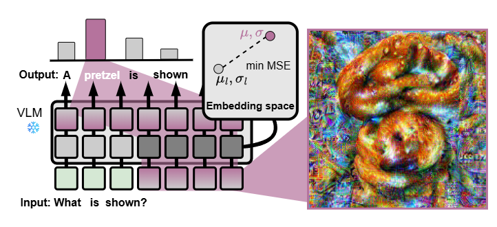

  

# MIMIC: Multimodal Inversion for Model Interpretation and Conceptualization

<p align="center">
  <a href="https://www.linkedin.com/in/animesh-jain1203/">Animesh Jain</a>,
  <a href="https://alexandrosstergiou.github.io/">Alexandros Stergiou</a
  ><br />
  University of Twente, The Netherlands
</p>
<p align="center"></p>
<p align="center">
  <a href="https://anaekin.github.io/MIMIC">Project Page 🌐</a> |
  <a href="https://arxiv.org/abs/XXXX.XXXXX">arXiv 📄</a>
</p>

<p align="center">
  
</p>
<p>
  Visualizing what Vision-Language Models “see” — MIMIC synthesizes images
  that reveal the visual concepts behind their internal representations.
</p>

## Table of contents

1. [Introduction](#introduction)
2. [Installation](#installation)
3. [Target Models](#target-models)
4. [Usage](#usage)
   - [Prompt Template](#prompt-template)
   - [Compute target feature statistics](#compute-target-feature-statistics)
   - [Running MIMIC](#running-mimic)
5. [Citation](#citation)
6. [License](#license)

## Introduction

Understanding how Vision-Language Models (VLMs) represent visual concepts is challenging due to their complex, multimodal nature. **MIMIC** addresses this by reconstructing visual representations directly from a model’s outputs, offering an accessible way to explore and interpret what these models have learned.

This repository provides the official code, resources, and scripts used in the paper.

## Installation

Clone the repository and set up the environment before running MIMIC.

```bash
# Clone this repository
git clone https://github.com/anaekin/MIMIC.git
cd MIMIC

# Create and activate conda environment
conda env create -f environment.yml
conda activate mimic

# Install any additional dependencies
pip install -r requirements.txt
```

## Target Models

We used [Intel/llava-llama-3-8b](https://huggingface.co/Intel/llava-llama-3-8b) model from the huggingface. This model is based on [LLaVA-v1.5 framework](https://arxiv.org/abs/2310.03744) with the 8-billion parameter [meta-llama/Meta-Llama-3-8B](https://huggingface.co/meta-llama/Meta-Llama-3-8B) model as language backbone. Please follow the instructions from huggingface to save the model locally.

## Usage

To reproduce the results from the paper or run MIMIC on new concepts, follow the workflow below.
First, prepare the text prompts that will guide the inversion.
Next, extract target feature statistics from real images of the chosen concept.
Finally, run the inversion script to generate images that visualize the model’s internal representation.

### Prompt Template

We use `./data/prompts.json` to get the list of acceptable [ImageNet](https://www.image-net.org/download.php) classes. It also contains the gold label (assistant message) for the inversion training. You can use the available list or modify/create the list accordingly. To modify/create the list, you can use following template object -

```json
[
  {
    "class_index": <imagenet-class-idx>,
    "class_name": <imagenet-class-name>,
    "chat_sequence": [
      [
        <user-message>,
        <assistant-message>
      ],
      [
        <user-message>,
        <assistant-message>
      ],
      ...
    ]
  }
]
```

### Compute target feature statistics

Before running the inversion, we need to compute target feature stats from the selected layers of VLM's vision tower.

Example command to pre-compute the target statistics -

```bash
python run_feature_extraction.py --fp16 \
    --target_class=<imagenet-class-idx> \
    --target_features_dir=./target_features \
    --dataset_dir=<imagenet-dir> \
    --vlm_checkpoint=<model-dir>
```

> **Note:** Currently, only [ImageNet](https://www.image-net.org/download.php) dataset can be used for computing target features. To use different dataset, replace `ImageNetDataset` and `ImageNetDataloader`. Replace `<model-dir>` with saved model path and `<dataset-dir>` with the desired dataset path.

### Running MIMIC

Example command for running VLM inversion using MIMIC:

```bash
accelerate launch run_mimic.py \
    --vlm_checkpoint=<model-dir> \
    --dataset_dir=<imagenet-dir> \
    --wandb_project=mimic \
    --fp16 \
    --grad_accumulation_steps 1 \
    --n_jitter_iterations 0 \
    --jitter 4 \
    --n_iterations 5000 \
    --batch_size_per_device 4 \
    --outputs_dir=./outputs \
    --results_dir=./results \
    --target_class 932 \
    --lr=0.3 \
    --min_lr=0.00001 \
    --main_loss_scale 0.005 \
    --feature_guide_scale 0.004 \
    --feature_base_scale 0.04 \
    --tv_l1_scale 0.0007 \
    --tv_l2_scale 0.0004 \
    --l2_scale 0.0003 \
    --patch_prior_scale 0.0005 \
    --seed 0
```

> To run on multiple GPUs - `accelerate launch --num_processes=2 --multi_gpu run_mimic.py`

## Citation

```bibtex
  @article{jain2025mimic,
    title = {MIMIC: Multimodal Inversion for Model Interpretation and Conceptualization},
    author = {Jain, Animesh and Stergiou, Alexandros},
    year = {2025},
    journal = {arXiv}
  }
```

## License

This project is licensed under the Apache License 2.0.  
See the [LICENSE](LICENSE) file for details.
